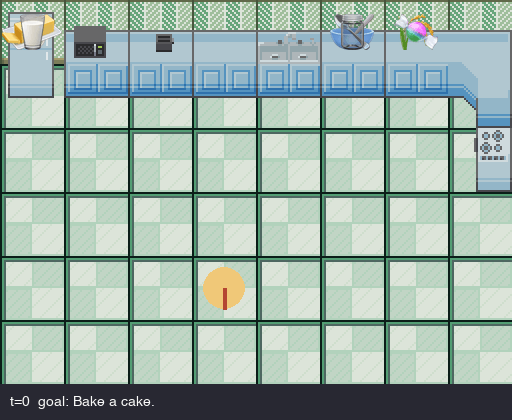

Humanoid's vision is for robots to revolutionalise households in 2031. Thus we simulate Claude chef. 

This is a 2D top-down kitchen where Claude is the chef. The agent perceives the world as text each turn, picks one tool call (`navigate_to`, `pick_up`, `place`, `pour`, `whisk`, `set_appliance`, `wait`), and the deterministic simulator advances. 

**See `DESIGN.md` for the design decisions.**


## Defining an Input 

A task lives in `kitchen_agent/tasks/` as a module with three pieces:

- `starting_world()` — sets up the kitchen (entities, positions, agent start). Used once at the beginning.
- `is_goal_met(world)` — pure verifier checked every turn. Programmatic by design, never trusts the agent's self-report. *E.g. for `bake_cake`: returns True only when `cake_tin` contains a `batter` ingredient with `cook_state == COOKED` — RAW, COOKING, and BURNT all fail the check.*
- A goal string on `World` (e.g. `"Bake a cake."`).

**The agent only ever sees the goal string.** The starting world and goal verifier are harness scaffolding — the agent doesn't know they exist. All actions are derived by Claude from the goal string plus the current observation; the verifier silently checks success in the background.


## Example run

A full successful `bake_cake` run with the above input format, recorded straight from `python -m kitchen_agent.run --task bake_cake`:



*Note, since I ran out of emojis to use, the sweet represents sugar and the jar represents a cake tin*


## Requirements

- macOS (the renderer uses Apple Color Emoji via Pillow; on Linux you'll get text fallbacks for ingredient glyphs)
- Python 3.11+
- An Anthropic API key

## Install

```bash
git clone https://github.com/sere-nity/Agent-Baking-A-Cake.git
cd Agent-Baking-A-Cake
python3 -m venv .venv && source .venv/bin/activate
pip install -e ".[dev]"
cp .env.example .env       # then add ANTHROPIC_API_KEY=sk-ant-...
```

## Run the headline demo

```bash
python -m kitchen_agent.run --task bake_cake
```

Expected: the agent succeeds in ~25–30 steps, about 1–2 minutes of wall clock. Outputs land in `outputs/`:

- `run_bake_cake_<ts>.jsonl` — one JSON line per turn (`tool_name`, `tool_args`, `success`, `message`, `reasoning`).
- `run_bake_cake_<ts>.gif` — animated playback. `wait` frames are compressed in the GIF so on-screen cook time appears faster than the simulator tick — the JSONL log has the true `t`.


## The insurance task

```bash
python -m kitchen_agent.run --task get_apple
```

Two steps, ~10 seconds. If this works the harness works; the cake is the same loop with more turns.


## Layout

```
kitchen_agent/
├── world/       Pydantic schemas + hand-built starting worlds
├── env/         KitchenEnv, seven transitions, BFS pathfinding, observation builder
├── agent/       Anthropic tool schemas + ClaudeAgent (tool-use loop)
├── rendering/   pygame renderer + sprite map + PIL emoji glyphs
└── run.py       CLI entry, Rich console output, JSONL + GIF logging
tests/           schema + transition tests (no LLM, no pygame)
scripts/         hand-driven recipe walkthrough (no LLM)
```

## Attribution

Kitchen tile assets by **Reakain** — https://reakain.itch.io/kitchen-assets
